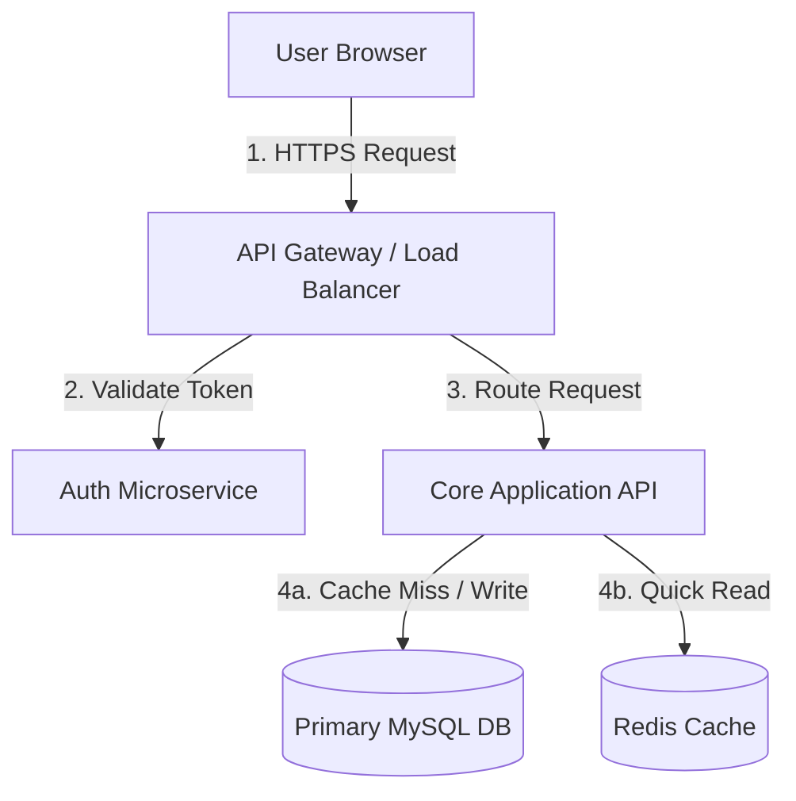

# Load Balanced App Diagram

[← Back to Diagram Index](./index.md)

Related notes: [Load Balancing](../../system-design/fundamentals/load_balancing.md), [Caching](../../system-design/fundamentals/caching.md), [Databases](../../system-design/fundamentals/databases.md)

