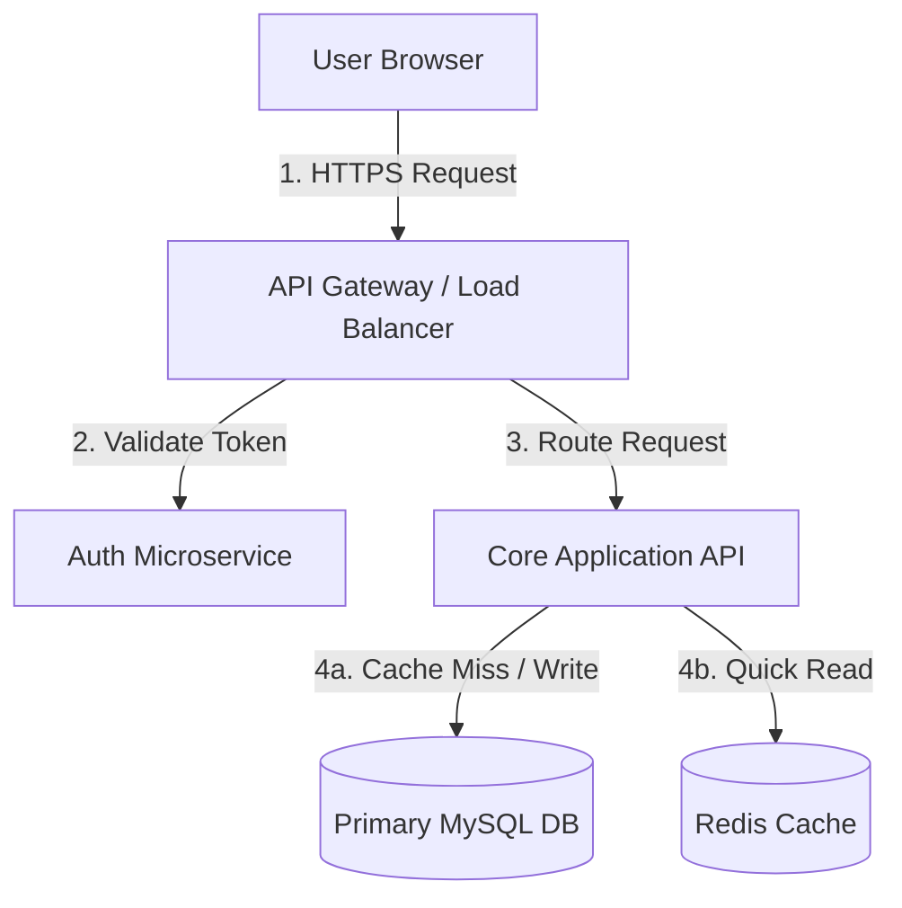

```mermaid
flowchart TD
    %% Define the nodes/components
    Client[User Browser]
    Gateway[API Gateway / Load Balancer]
    AuthService[Auth Microservice]
    CoreApp[Core Application API]
    MainDB[(Primary MySQL DB)]
    Cache[(Redis Cache)]

    %% Define the connections and labels
    Client -->|1. HTTPS Request| Gateway
    Gateway -->|2. Validate Token| AuthService
    Gateway -->|3. Route Request| CoreApp

    %% Split path for Read/Write
    CoreApp -->|4a. Cache Miss / Write| MainDB
    CoreApp -->|4b. Quick Read| Cache
```
