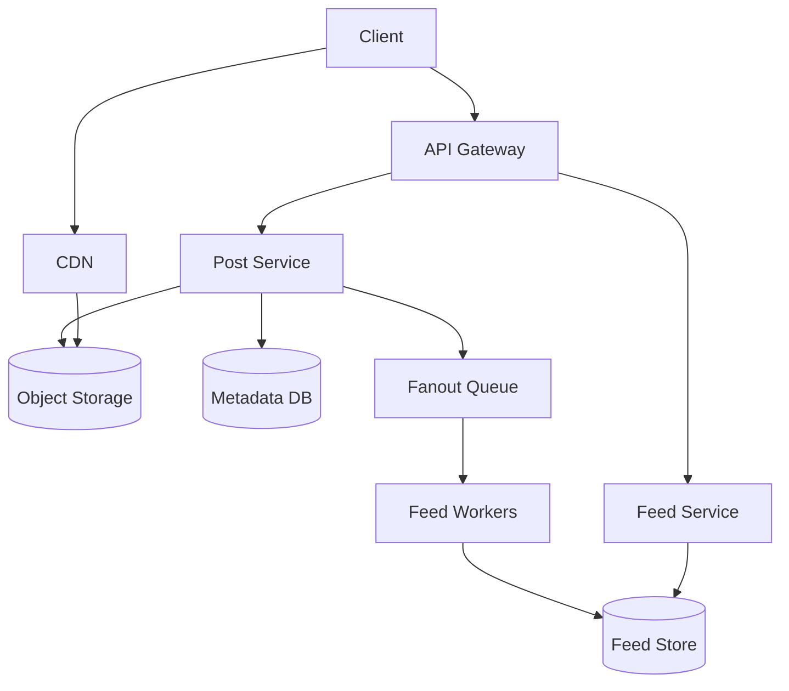

# Instagram

[← Back to System Design Index](../index.md)

Design a photo-sharing system where users can upload media, follow other users, and view a personalized feed.

Related fundamentals: [Caching](../fundamentals/caching.md), [Databases](../fundamentals/databases.md), [Load Balancing](../fundamentals/load_balancing.md)

## Requirements

### Functional

- Users can upload photos or videos.
- Users can follow and unfollow other users.
- Users can view a home feed.
- Users can like and comment on posts.

### Non-Functional

- Low-latency feed reads.
- Highly available media delivery.
- Durable media storage.
- Eventual consistency is acceptable for feeds, likes, and comments.

## Back-Of-The-Envelope Estimation

| Metric | Example Assumption |
| --- | --- |
| DAU | 100 million |
| Uploads | Millions per day |
| Feed reads | Much higher than writes |
| Media size | Photos and videos dominate storage |

## API Design

```http
POST /api/v1/posts
GET /api/v1/feed
POST /api/v1/users/{userId}/follow
POST /api/v1/posts/{postId}/likes
```

## Data Model

| Entity | Important Fields |
| --- | --- |
| User | `id`, `username`, `profile_url` |
| Post | `id`, `author_id`, `media_url`, `caption`, `created_at` |
| Follow | `follower_id`, `followee_id`, `created_at` |
| FeedItem | `user_id`, `post_id`, `rank`, `created_at` |

## High-Level Design



## Deep Dive

- Store media in object storage and serve it through a CDN.
- Store metadata separately from binary media.
- Use fanout-on-write for normal users to make feed reads fast.
- Use fanout-on-read or hybrid fanout for celebrities with many followers.
- Rank feed items using recency, engagement, and relationship signals.

## Trade-Offs

- Fanout-on-write makes reads fast but writes expensive for high-follower accounts.
- Fanout-on-read keeps writes cheap but makes feed reads slower.
- Eventual consistency keeps the system scalable but can show delayed likes, comments, or posts.

## Key Takeaways

- Media delivery should be decoupled from metadata APIs.
- Feed generation is the core scaling problem.
- A hybrid fanout strategy usually works better than one universal approach.
