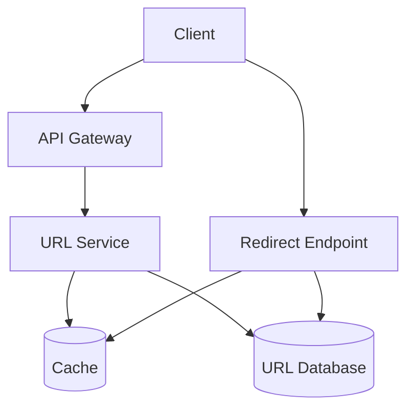

# URL Shortener

[← Back to System Design Index](../index.md)

Design a service that turns long URLs into short aliases and redirects users from the short URL to the original URL.

Related fundamentals: [Caching](../fundamentals/caching.md), [Databases](../fundamentals/databases.md), [Load Balancing](../fundamentals/load_balancing.md)

## Requirements

### Functional

- Create a short URL for a long URL.
- Redirect a short URL to the original URL.
- Optionally support custom aliases and expiration times.
- Track basic analytics such as click count.

### Non-Functional

- Low-latency redirects.
- High availability.
- Short codes should be unique.
- System should handle read-heavy traffic.

## Back-Of-The-Envelope Estimation

| Metric | Example Assumption |
| --- | --- |
| New URLs | 100 million per month |
| Read/write ratio | 100:1 |
| Redirect QPS | Much higher than creation QPS |
| Storage | Short code, long URL, user metadata, timestamps |

## API Design

```http
POST /api/v1/urls
GET /{shortCode}
```

## Data Model

| Field | Notes |
| --- | --- |
| `short_code` | Primary key. |
| `long_url` | Original destination. |
| `created_at` | Creation timestamp. |
| `expires_at` | Optional expiration. |
| `user_id` | Optional owner. |

## High-Level Design



## Deep Dive

- Generate IDs using base62 encoding, Snowflake-style IDs, or a pre-generated key service.
- Cache popular short codes because redirects dominate traffic.
- Use database uniqueness constraints to prevent duplicate short codes.
- Add abuse prevention for malicious URLs and spam.

## Trade-Offs

- Random codes are simple but may collide.
- Sequential IDs are easy to encode but can reveal traffic volume.
- Custom aliases improve UX but require conflict handling.

## Key Takeaways

- Optimize the redirect path first because it is the hottest path.
- Cache short-code lookups, but keep the database as source of truth.
- ID generation strategy determines collision handling and predictability.
