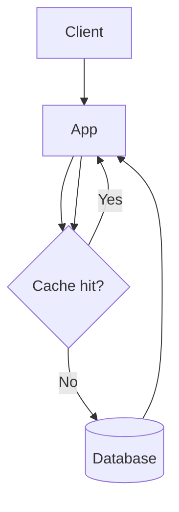

# Caching

[← Back to System Design Index](../index.md)

Caching stores frequently accessed data closer to the caller so reads are faster and primary systems do less repeated work.

Related notes: [Load Balancing](./load_balancing.md), [Databases](./databases.md), [URL Shortener](../case-studies/url_shortener.md), [Load Balanced App Diagram](../../assets/diagrams/load_balanced_app.md)

## When To Use

- Expensive reads are repeated often.
- Data can tolerate short-lived staleness.
- The database or downstream service is a bottleneck.
- Latency requirements are tighter than the source of truth can consistently provide.

## Common Patterns

| Pattern | Flow | Trade-Off |
| --- | --- | --- |
| Cache-aside | App checks cache, loads DB on miss, writes cache. | Simple, but first request after miss is slower. |
| Write-through | Write cache and database together. | More consistent reads, slower writes. |
| Write-back | Write cache first, flush to DB later. | Fast writes, higher data-loss risk. |
| Refresh-ahead | Refresh hot keys before expiration. | Smoother latency, extra background work. |

## Cache-Aside Example

## Design Notes

- Use TTLs to limit stale data.
- Add jitter to TTLs to avoid many hot keys expiring at the same time.
- Protect the database from cache stampedes with request coalescing or locks.
- Pick eviction policies based on access patterns: LRU, LFU, FIFO, or custom.

## Common Failure Modes

- Stale reads after writes.
- Hot keys overloading one cache node.
- Cache stampede after expiration.
- Cascading failure when cache is down and all traffic falls through to the database.

## Key Takeaways

- Cache invalidation strategy matters as much as cache placement.
- Caches reduce average latency but can add consistency and operational complexity.
- Always define the source of truth.
