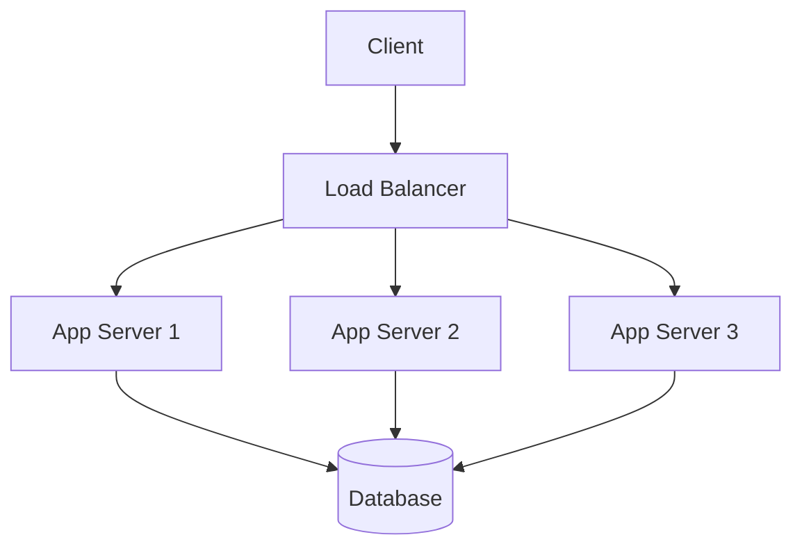

# Load Balancing

[← Back to System Design Index](../index.md)

Load balancers distribute incoming traffic across multiple healthy servers to improve availability, scalability, and fault tolerance.

Related notes: [Caching](./caching.md), [Databases](./databases.md), [Load Balanced App Diagram](../../assets/diagrams/load_balanced_app.md)

## Types

| Type | Layer | Common Use |
| --- | --- | --- |
| L4 | Transport | Fast TCP/UDP routing by IP and port. |
| L7 | Application | HTTP routing by path, host, headers, or cookies. |
| Global | DNS / edge | Route users to regions based on latency or health. |

## Algorithms

| Algorithm | Best For | Notes |
| --- | --- | --- |
| Round robin | Similar servers and request costs. | Simple but ignores active load. |
| Least connections | Long-lived or uneven requests. | Needs connection tracking. |
| Weighted round robin | Mixed server capacity. | Larger nodes receive more traffic. |
| Consistent hashing | Sticky routing or cache clusters. | Reduces remapping when nodes change. |

## Example

## Design Notes

- Health checks should remove unhealthy instances quickly without flapping.
- Use connection draining before removing instances during deploys.
- Keep application servers stateless when possible.
- For stateful sessions, prefer shared session storage over sticky sessions.

## Common Failure Modes

- Load balancer becomes a single point of failure.
- Bad health checks route traffic to broken instances.
- Uneven traffic from hot keys or sticky sessions.
- Retry storms amplify overload.

## Key Takeaways

- Load balancing improves availability only when there are multiple healthy targets.
- L7 routing is more flexible; L4 routing is usually faster and simpler.
- Pair load balancing with autoscaling, health checks, and observability.
