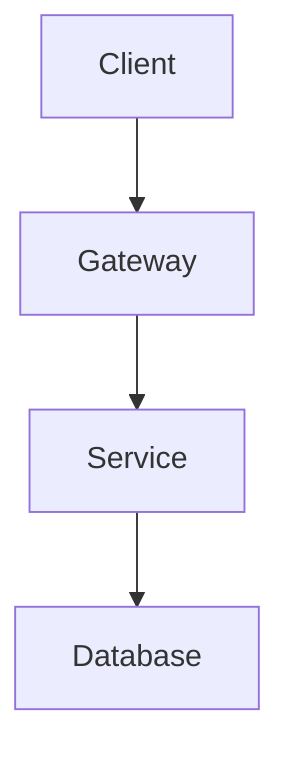

# System Design Index

[← Back to README](../README.md)

Master table for system design fundamentals and case studies.

## Fundamentals

| Topic | What To Know | Notes |
| --- | --- | --- |
| [Caching](./fundamentals/caching.md) | Cache-aside, invalidation, eviction, TTLs. | Improves latency and reduces database load. |
| [Load Balancing](./fundamentals/load_balancing.md) | L4/L7 balancing, health checks, algorithms. | Distributes traffic across healthy backends. |
| [Databases](./fundamentals/databases.md) | SQL vs NoSQL, replication, sharding, indexing. | Usually the core scaling bottleneck. |

## Case Studies

| System | Core Concepts | Status |
| --- | --- | --- |
| [URL Shortener](./case-studies/url_shortener.md) | ID generation, redirects, storage, caching. | Starter walkthrough |
| [Instagram](./case-studies/instagram.md) | Media uploads, feeds, fanout, CDN. | Template |

## Study Backlog

| Area | Topics |
| --- | --- |
| Volume 1 fundamentals | Scale from zero to millions, back-of-the-envelope estimation, interview framework. |
| Volume 1 design problems | Rate limiter, consistent hashing, key-value store, unique ID generator, URL shortener, web crawler, notification system, news feed, chat, autocomplete, YouTube, Google Drive. |
| Volume 2 design problems | Proximity service, nearby friends, Google Maps, distributed message queue, metrics monitoring, ad click aggregation, hotel reservation, distributed email, S3-like object storage, real-time leaderboard, payment system, digital wallet, stock exchange. |

## Interview Framework

1. Clarify requirements and scope.
2. Estimate scale: users, QPS, storage, bandwidth, latency.
3. Propose high-level design and APIs.
4. Deep dive into bottlenecks, data model, consistency, and failure modes.
5. Summarize trade-offs and follow-up improvements.

## Case Study Template

````markdown
# System Name

## Requirements

### Functional

### Non-Functional

## Back-Of-The-Envelope Estimation

## API Design

## Data Model

## High-Level Design



## Deep Dive

## Trade-Offs

## Failure Modes

## Key Takeaways
````
